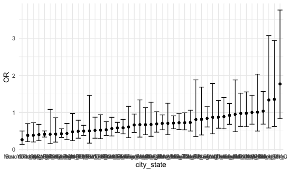

Homework 6
================
Yuqi Wang

``` r
library(tidyverse)
```

    ## ── Attaching packages ─────────────────────────────────────── tidyverse 1.3.0 ──

    ## ✓ ggplot2 3.3.2     ✓ purrr   0.3.4
    ## ✓ tibble  3.0.3     ✓ dplyr   1.0.2
    ## ✓ tidyr   1.1.2     ✓ stringr 1.4.0
    ## ✓ readr   1.3.1     ✓ forcats 0.5.0

    ## ── Conflicts ────────────────────────────────────────── tidyverse_conflicts() ──
    ## x dplyr::filter() masks stats::filter()
    ## x dplyr::lag()    masks stats::lag()

``` r
library(modelr)
library(p8105.datasets)

knitr::opts_chunk$set(
  fig.width = 6,
  fig.asp = .6,
  out.width = "90%"
)

theme_set(theme_minimal() + theme(legend.position = "bottom"))

options(
  ggplot2.continuous.colour = "viridis",
  ggplot2.continuous.fill = "viridis"
)

scale_colour_discrete = scale_colour_viridis_d
scale_fill_discrete = scale_fill_viridis_d

set.seed(1)
```

## Problem 1

``` r
homicide_df = read_csv(file = "./data/homicide-data.csv") %>% 
  mutate(
    city_state = str_c(city, state, sep = "_"),
    victim_age = as.numeric(victim_age),
    resolved = case_when(
      disposition  == "Closed without arrest" ~ "0",
      disposition  == "Open/No arrest" ~ "0",
      disposition  == "Closed by arrest" ~ "1",
    )
  ) %>% 
  filter(
    victim_race %in% c("White", "Black"),
    city_state != "Tulsa_AL") %>% 
  select(city_state, resolved, victim_age, victim_race, victim_sex)
```

    ## Parsed with column specification:
    ## cols(
    ##   uid = col_character(),
    ##   reported_date = col_double(),
    ##   victim_last = col_character(),
    ##   victim_first = col_character(),
    ##   victim_race = col_character(),
    ##   victim_age = col_character(),
    ##   victim_sex = col_character(),
    ##   city = col_character(),
    ##   state = col_character(),
    ##   lat = col_double(),
    ##   lon = col_double(),
    ##   disposition = col_character()
    ## )

    ## Warning: Problem with `mutate()` input `victim_age`.
    ## ℹ NAs introduced by coercion
    ## ℹ Input `victim_age` is `as.numeric(victim_age)`.

    ## Warning in mask$eval_all_mutate(dots[[i]]): NAs introduced by coercion

start with one city:

``` r
baltimore_df = 
  homicide_df %>% 
  filter(city_state == "Baltimore_MD") %>% 
  mutate(resolved = as.numeric(resolved))

glm(resolved ~ victim_age + victim_sex,
    data = baltimore_df,
    family = binomial()) %>% 
  broom::tidy() %>% 
  mutate(
    OR = exp(estimate),
    CI_lower = exp(estimate - 1.96*std.error),
    CI_upper = exp(estimate + 1.96*std.error)
  ) %>% 
  select(term, OR, starts_with("CI")) %>% 
  knitr::kable(digits = 3)
```

| term            |    OR | CI\_lower | CI\_upper |
| :-------------- | ----: | --------: | --------: |
| (Intercept)     | 1.469 |     1.054 |     2.047 |
| victim\_age     | 0.996 |     0.989 |     1.002 |
| victim\_sexMale | 0.381 |     0.292 |     0.496 |

Try this accross cities:

``` r
model_results = homicide_df %>%
  mutate(resolved = as.numeric(resolved)) %>% 
  nest(data = -city_state) %>% 
  mutate(
    models = map(.x = data, ~glm(resolved ~ victim_age + victim_race + victim_sex, data = .x, family = binomial())), 
    results = map(models, broom::tidy)
  ) %>% 
  select(city_state, results) %>% 
  unnest(results) %>% 
  mutate(
    OR = exp(estimate),
    CI_lower = exp(estimate - 1.96*std.error),
    CI_upper = exp(estimate + 1.96*std.error)
  ) %>% 
  select(city_state, term, OR, starts_with("CI"))
```

Make a plot

``` r
model_results %>% 
  filter(term == "victim_sexMale") %>% 
  mutate(city_state = fct_reorder(city_state, OR)) %>% 
  ggplot(aes(x = city_state, y = OR)) +
  geom_point() +
  geom_errorbar(aes(ymin = CI_lower, ymax = CI_upper))
```



``` r
  theme(axis.text.x = element_text(angle = 90, vjust = 0.5, hjust = 1))
```

    ## List of 1
    ##  $ axis.text.x:List of 11
    ##   ..$ family       : NULL
    ##   ..$ face         : NULL
    ##   ..$ colour       : NULL
    ##   ..$ size         : NULL
    ##   ..$ hjust        : num 1
    ##   ..$ vjust        : num 0.5
    ##   ..$ angle        : num 90
    ##   ..$ lineheight   : NULL
    ##   ..$ margin       : NULL
    ##   ..$ debug        : NULL
    ##   ..$ inherit.blank: logi FALSE
    ##   ..- attr(*, "class")= chr [1:2] "element_text" "element"
    ##  - attr(*, "class")= chr [1:2] "theme" "gg"
    ##  - attr(*, "complete")= logi FALSE
    ##  - attr(*, "validate")= logi TRUE

## Problem 2

First, read the data and check all variable type.

``` r
baby_df = read_csv("./data/birthweight.csv") %>% 
  mutate(
    babysex = case_when(
      babysex == "1" ~ "male",
      babysex == "2" ~ "female",
      TRUE ~ as.character(babysex)
    ),
    frace = case_when(
      frace == "1" ~ "white",
      frace == "2" ~ "black",
      frace == "3" ~ "Asian",
      frace == "4" ~ "Puerto Rican",
      frace == "8" ~ "Other",
      frace == "9" ~ "Unknown",
      TRUE ~ as.character(frace)
    ),
    malform = case_when(
      malform == "0" ~ "absent",
      malform == "1" ~ "present",
      TRUE ~ as.character(malform)
    ),
    mrace = case_when(
      mrace == "1" ~ "white",
      mrace == "2" ~ "black",
      mrace == "3" ~ "Asian",
      mrace == "4" ~ "Puerto Rican",
      mrace == "8" ~ "Other",
      mrace == "9" ~ "Unknown",
      TRUE ~ as.character(mrace)
    ))
```

    ## Parsed with column specification:
    ## cols(
    ##   .default = col_double()
    ## )

    ## See spec(...) for full column specifications.

``` r
baby_df %>% 
  count(pnumlbw)
```

    ## # A tibble: 1 x 2
    ##   pnumlbw     n
    ##     <dbl> <int>
    ## 1       0  4342

``` r
baby_df %>% 
  count(pnumsga)
```

    ## # A tibble: 1 x 2
    ##   pnumsga     n
    ##     <dbl> <int>
    ## 1       0  4342

``` r
###### How to quickly identify missing values. will it be considered normal as for some people, the bwt is too small.
```

Second, use previous knowledge and the backward modeling method to find
the appropriate the model.

For the outcome variable, the following plot shows that the birthweight
is about normally distributed, so we will use linear regression.

``` r
baby_df %>% 
  ggplot(aes(x = bwt)) + 
  geom_histogram()
```

    ## `stat_bin()` using `bins = 30`. Pick better value with `binwidth`.


Since we have the ppbmi variable, we will exclude the mother’s height
and pre-pregnancy weight in the model to avoid over adjusting. Also,
since wtgain was calculated by delwt and ppwt, we will remove delwt.
Additionally, pnumlbw and pnumgsa are two variables that seem to be
closely correlated, and all participants have 0 for the two variables,
we will remove the two.

Then, I will add all the other variables into the model for backward
selection.

``` r
model_naive = lm(bwt ~ babysex + bhead + blength + fincome + frace + gaweeks + malform + menarche + momage + mrace + parity + ppbmi + smoken + wtgain, data = baby_df)

model_naive %>% 
  broom::tidy() %>% 
  select(term, estimate, p.value) %>% 
  knitr::kable(digits = 3)
```

| term              |   estimate | p.value |
| :---------------- | ---------: | ------: |
| (Intercept)       | \-5820.935 |   0.000 |
| babysexmale       |   \-31.532 |   0.000 |
| bhead             |    131.729 |   0.000 |
| blength           |     76.688 |   0.000 |
| fincome           |      0.387 |   0.032 |
| fraceblack        |      2.170 |   0.978 |
| fraceOther        |   \-26.202 |   0.790 |
| fracePuerto Rican |   \-70.504 |   0.372 |
| fracewhite        |   \-23.430 |   0.737 |
| gaweeks           |     11.269 |   0.000 |
| malformpresent    |      3.537 |   0.960 |
| menarche          |    \-2.317 |   0.426 |
| momage            |      1.426 |   0.245 |
| mraceblack        |   \-45.987 |   0.572 |
| mracePuerto Rican |     29.788 |   0.715 |
| mracewhite        |    115.065 |   0.111 |
| parity            |     90.565 |   0.026 |
| ppbmi             |      6.780 |   0.000 |
| smoken            |    \-4.604 |   0.000 |
| wtgain            |      4.124 |   0.000 |

After comparing the P-values with the pre-set value of 0.05, we will
include `babysex`, `bhead`, `blength`, `fincome`, `gaweeks`, `parity`,
`ppbmi`, `smoken` and `wtgain` into our model to predict baby
birthweight.

Next, we will draw a plot for the residuals against the fitted values.

``` r
model_1 = lm(bwt ~ babysex + bhead + blength + fincome + gaweeks + parity + ppbmi + smoken + wtgain, data = baby_df) 

baby_df %>% 
  add_predictions(model_1, var = "predicted") %>% 
  add_residuals(model_1, var = "resid") %>% 
  ggplot(aes(x = predicted, y = resid))+
  geom_point()
```


The scatter plot shows that for most observations, the residuals are not
heavily skewed and there is no clear trend between the fitted value and
the residuals when the predicted birthweight is larger than 2000g.
However, when the predicted values are smaller than 2000, there seems to
be a decreasing trend of the residuals, which we may consider as
outliers.

#### Compare my model with the other two models using cross validation

``` r
model_2 = lm(bwt ~ blength + gaweeks, data = baby_df)
model_3 = lm(bwt ~ bhead * blength * babysex, data = baby_df)
```

``` r
cv_df = 
  crossv_mc(baby_df, 100) %>% 
  mutate(
    train = map(train, as_tibble),
    test = map(test, as_tibble)) %>% 
  mutate(
    model_1 = map(train, ~lm(bwt ~ babysex + bhead + blength + fincome + gaweeks + parity + ppbmi + smoken + wtgain, data = .x)),
    model_2 = map(train, ~lm(bwt ~ blength + gaweeks, data = .x)),
    model_3 = map(train, ~lm(bwt ~ bhead * blength * babysex, data = .x))) %>% 
  mutate(
    rmse_1 = map2_dbl(model_1, test, ~rmse(model = .x, data = .y)),
    rmse_2 = map2_dbl(model_2, test, ~rmse(model = .x, data = .y)),
    rmse_3 = map2_dbl(model_3, test, ~rmse(model = .x, data = .y)),
  )
```

    ## Warning: Problem with `mutate()` input `rmse_1`.
    ## ℹ prediction from a rank-deficient fit may be misleading
    ## ℹ Input `rmse_1` is `map2_dbl(model_1, test, ~rmse(model = .x, data = .y))`.

    ## Warning in predict.lm(model, data): prediction from a rank-deficient fit may be
    ## misleading

``` r
rmse_df = cv_df %>% 
  select(starts_with("rmse")) %>% 
  pivot_longer(
    everything(),
    names_to = "model", 
    values_to = "rmse",
    names_prefix = "rmse_") 

rmse_df %>% 
  group_by(model) %>% 
  summarize(avg_rmse = mean(rmse)) %>% 
  knitr::kable()
```

    ## `summarise()` ungrouping output (override with `.groups` argument)

| model | avg\_rmse |
| :---- | --------: |
| 1     |  280.4215 |
| 2     |  332.2287 |
| 3     |  288.6030 |

``` r
rmse_df %>% 
  mutate(model = fct_inorder(model)) %>% 
  ggplot(aes(x = model, y = rmse)) + geom_violin()
```


According to the average RMSE value and the violin plot, the first model
(with `babysex`, `bhead`, `blength`, `fincome`, `gaweeks`, `parity`,
`ppbmi`, `smoken` and `wtgain`) is the best as it have the lowest RMSE.
The model with `bhead`, `blength` `babysex`, and all the interactions is
the second fitted model, while the model with only `blength` and
`gaweeks` are the worst one.

We would like to use the first model for future analysis and prediction.

## Problem 3

First, load the data.

``` r
weather_df = 
  rnoaa::meteo_pull_monitors(
    c("USW00094728"),
    var = c("PRCP", "TMIN", "TMAX"), 
    date_min = "2017-01-01",
    date_max = "2017-12-31") %>%
  mutate(
    name = recode(id, USW00094728 = "CentralPark_NY"),
    tmin = tmin / 10,
    tmax = tmax / 10) %>%
  select(name, id, everything())
```

    ## Registered S3 method overwritten by 'hoardr':
    ##   method           from
    ##   print.cache_info httr

    ## using cached file: /Users/wangyuqi/Library/Caches/R/noaa_ghcnd/USW00094728.dly

    ## date created (size, mb): 2020-10-05 10:31:49 (7.522)

    ## file min/max dates: 1869-01-01 / 2020-10-31

Second, conduct bootstrapping and calculate the estimated R square and
log(beta0\*beta1).

``` r
boot_straps = 
  weather_df %>% 
  modelr::bootstrap(n = 5000)  %>% 
  mutate(
    models = map(strap, ~lm(tmax ~ tmin, data = .x) ),
    betas = map(models, broom::tidy),
    rsq = map(models, broom::glance)) 

strap_df = boot_straps %>% 
  select(-strap, -models) %>% 
  unnest(betas, rsq) %>% 
  select(.id, term, estimate, r.squared) %>% 
  pivot_wider(
    names_from = term,
    values_from = estimate
  ) %>% 
  janitor::clean_names() %>% 
  mutate(
    log_product = log(intercept*tmin)
  )
```

    ## Warning: unnest() has a new interface. See ?unnest for details.
    ## Try `df %>% unnest(c(betas, rsq))`, with `mutate()` if needed

Third, make the plot to show the distribution of the estimated R square
and log(beta0\*beta1).

``` r
strap_df %>% 
  ggplot(aes(x = r_squared)) + 
  geom_density()
```


``` r
strap_df %>% 
  ggplot(aes(x = log_product)) + 
  geom_density()
```


For the distribution of the r-squares, it is a slightly right-skewed
distribution with a peak of 0.915.

For the distribution of the log(beta0\*beta1), the distribution is a
symmetric normal distribution with a peak of 2.02.

Identify the 95%CI for the two estimates:

``` r
strap_df %>% 
  summarize(
    r_ci_lower = quantile(r_squared, 0.025), 
    r_ci_upper = quantile(r_squared, 0.975),
    log_ci_lower = quantile(log_product, 0.025), 
    log_ci_upper = quantile(log_product, 0.975),
    ) %>% 
  knitr::kable(digit = 3)
```

| r\_ci\_lower | r\_ci\_upper | log\_ci\_lower | log\_ci\_upper |
| -----------: | -----------: | -------------: | -------------: |
|        0.894 |        0.927 |          1.967 |          2.059 |

The result shows that the 95%CI for r-square is (0.894, 0.927), and for
log(beta0\*beta1) is (1.965, 2.059).
